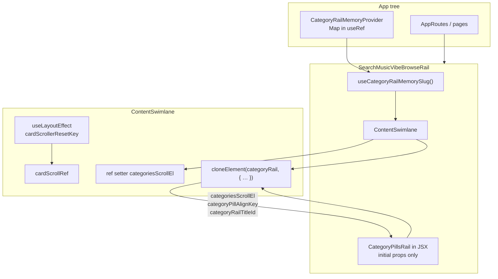
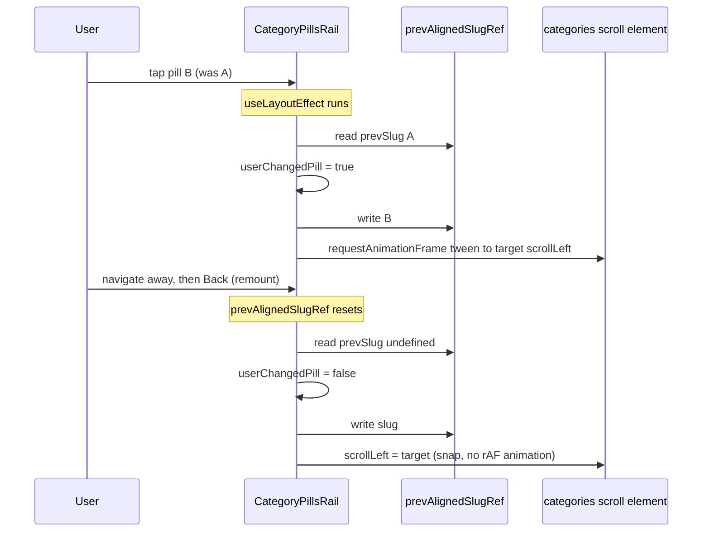

# Tutorial: `ContentSwimlane` and the category rail variant

This document walks through **[`src/components/ContentSwimlane.jsx`](../../src/components/ContentSwimlane.jsx)** and the **reusable** category rail pieces: **[`CategoryPillsRail.jsx`](../../src/components/CategoryPillsRail.jsx)**, **[`categoryRailPillScroll.js`](../../src/utils/categoryRailPillScroll.js)**, **[`useCategoryRailMemorySlug.js`](../../src/hooks/useCategoryRailMemorySlug.js)**, **[`CategoryRailMemoryContext.jsx`](../../src/context/CategoryRailMemoryContext.jsx)**, plus the **consumer** **[`SearchMusicVibeBrowseRail.jsx`](../../src/components/SearchMusicVibeBrowseRail.jsx)** (broad music vibes: Genre, Activity, Mood, Era, Theme) and **[`ContentSwimlane.css`](../../src/components/ContentSwimlane.css)**.

It assumes you know **JSX**, **`useState`**, and **`useEffect`** basics. New ideas introduced here include **`useLayoutEffect`** (run **before** the browser paints), **`cloneElement`** (inject props into an existing element), **`useId`** (stable ids for accessibility), **`useRef`** for mutable boxes **without** re-render, and a tiny **`Map`** behind **`useMemo`** for cross-route memory.

**Layers (what to reuse vs what is IA-specific)**

| Layer | Files | Reuse for new browse IA |
|--------|--------|-------------------------|
| Swimlane chrome | **`ContentSwimlane.jsx`** + **`.css`** | Yes — unchanged props contract |
| Pill UI + alignment effect | **`CategoryPillsRail.jsx`** | Yes — pass **`rows`** + selection |
| Scroll math / tween | **`categoryRailPillScroll.js`** | Yes — expects **`ContentSwimlane`** category DOM + **`data-category-pill`** |
| Session slug memory | **`CategoryRailMemoryContext`** + **`useCategoryRailMemorySlug`** | Yes — new **`memoryKey`** per rail |
| Product wiring | Example: **`SearchMusicVibeBrowseRail.jsx`** | No — replace with your taxonomy, **`children`**, routes |

**Companion docs**

- Plan checklist (Steps A–G): [`../Plans/ContentSwimlane-category-rail-variant.md`](../Plans/ContentSwimlane-category-rail-variant.md)
- General swimlane layout tokens / gutters: [`../react-learning.md`](../react-learning.md) (*Swimlane layout pattern*, *ContentSwimlane*)

---

## 1. What problem each piece solves

| Piece | Responsibility |
|--------|----------------|
| **`ContentSwimlane`** | **Presentational** shell: title row, optional **category rail** strip (horizontal scroll), **card row** (horizontal scroll). Implements **More** either as a header button **or** (variant) a **trailing More tile** in the card row. Resets card **`scrollLeft`** when **`cardScrollerResetKey`** changes. **Does not** own **which** pill is selected. |
| **`CategoryRailMemoryProvider`** | Holds an **in-memory Map**: **`memoryKey` → last-selected slug**. Loses state on **full reload**, keeps state across **route unmount/remount** (e.g. user drilled down and pressed Back). |
| **`CategoryPillsRail`** | **Generic** pill row for any IA: props **`rows`** (`slug` + **`label`**). Receives **`categoriesScrollEl`**, **`categoryPillAlignKey`**, **`categoryRailTitleId`** via **`cloneElement`** from **`ContentSwimlane`**. Uses **`categoryRailPillScroll`** helpers inside **`useLayoutEffect`** (**snap vs tween**). **`radiogroupFallbackLabel`** when there is no lane heading id. |
| **`SearchMusicVibeBrowseRail`** | **Broad music vibe** wiring: **`getChildTagsForBroadVibe(vibeId)`**, **`useCategoryRailMemorySlug(memoryKey, …)`**, genre vs tag leaf routes, **`navigate`** drill-down. Composes **`ContentSwimlane`** + **`CategoryPillsRail`**; does **not** own scroll math. |

---

## 2. Where it lives in the repo

| File | Role |
|------|------|
| [`src/components/ContentSwimlane.jsx`](../../src/components/ContentSwimlane.jsx) | Swimlane shell + **`cloneElement`** bridge |
| [`src/components/ContentSwimlane.css`](../../src/components/ContentSwimlane.css) | Header, category scrollport, pills, trailing More tile |
| [`src/context/CategoryRailMemoryContext.jsx`](../../src/context/CategoryRailMemoryContext.jsx) | Provider + **`useCategoryRailMemory`** |
| [`src/components/CategoryPillsRail.jsx`](../../src/components/CategoryPillsRail.jsx) | Generic category pills + alignment effect |
| [`src/utils/categoryRailPillScroll.js`](../../src/utils/categoryRailPillScroll.js) | **`computeCategoryPillTargetScrollLeft`**, snap / animate helpers |
| [`src/hooks/useCategoryRailMemorySlug.js`](../../src/hooks/useCategoryRailMemorySlug.js) | **`memoryKey`** + **`rows`** + optional **`preferredSlug`** |
| [`src/components/SearchMusicVibeBrowseRail.jsx`](../../src/components/SearchMusicVibeBrowseRail.jsx) | Broad music — one swimlane per vibe (**Genre**, **Activity**, **Mood**, **Era**, **Theme**) |
| [`src/pages/Search.jsx`](../../src/pages/Search.jsx) | **`BROAD_VIBES.map`** → **`SearchMusicVibeBrowseRail`** when **`musicLineupMode === broad`** |
| [`src/App.jsx`](../../src/App.jsx) | **`CategoryRailMemoryProvider`** wraps **`AppRoutes`** (inside **`PlaybackProvider`**) |
| [`src/constants/swimlane.js`](../../src/constants/swimlane.js) | **`SWIMLANE_CARD_MAX`** (visible card cap for More predicate) |

---

## 3. Context flowchart — memory + props injected into the rail

Who remembers selection vs who scrolls the strip vs who resets cards:

**Reading the diagram**

- **Selection state** comes from **`useCategoryRailMemorySlug`** (**`useState`** + **`memory.get`/`set`**). Each **meaningful** change persists under a stable **`memoryKey`** so the **same tab session** can restore the slug after the browse screen unmounts.
- **`ContentSwimlane`** keeps a **DOM reference** to the **category scroll container** (**`categoriesScrollEl`**) and passes it **down** into **`CategoryPillsRail`** through **`cloneElement`**. The parent wrote **`CategoryPillsRail`** without those props in JSX; **`ContentSwimlane`** adds them at runtime.
- **Card row reset** is separate: **`cardScrollerResetKey={selectedSlug}`** tells **`ContentSwimlane`** to zero **`scrollLeft`** on the **card** scroller when the **category** changes (genre example; same pattern for any IA).

The flowchart names **`SearchMusicVibeBrowseRail`** as the reference consumer; a podcasts or radio rail would plug **`useCategoryRailMemorySlug`** + **`CategoryPillsRail`** into **`ContentSwimlane`** the same way.

---

## 4. Sequence — snap vs animated pill scroll

Two situations must **feel** different:

| Situation | Desired UX | Implementation |
|-----------|------------|----------------|
| User **taps another pill** on the **same screen visit** | Gentle **motion** (~280ms ease-out) | **`CategoryPillsRail`** **`useLayoutEffect`** detects **`prevSlug !== undefined`** and **`prevSlug !== slug`** → **`animateCategoryPillIntoScroll`** |
| **Navigate away and Back**, **first mount**, **same slug** re-layout, or **`Strict Mode`** double-invoke recovery | **No** visible tween; strip already correct **before paint** | **`userChangedPill`** is **false** → **`snapCategoryPillIntoScroll`** sets **`scrollLeft`** immediately inside **`useLayoutEffect`** |

**Why `useLayoutEffect` and not `useEffect`?**

- **`useLayoutEffect`** fires **after DOM updates** but **before** the browser paints. Snapping here avoids a **flash** of the wrong scroll position.
- **`useEffect`** runs **after paint**; users could see one frame at **`scrollLeft = 0`** before correction.

**Reduced motion**

- **`startAnimatedCategoryPillScroll`** checks **`prefers-reduced-motion: reduce`** and sets **`scrollLeft`** immediately (**same as snap**).

**Tiny moves**

- If **`|delta| < 2` px**, animation is skipped (**snap**) to avoid jitter.

---

## 5. Line by line — `CategoryRailMemoryContext.jsx`

File: [`src/context/CategoryRailMemoryContext.jsx`](../../src/context/CategoryRailMemoryContext.jsx)

| Line(s) | What it does |
|--------|----------------|
| **1** | Imports **`createContext`**, **`useContext`**, **`useMemo`**, **`useRef`** — no **`useState`**; the map lives in a **ref** so **`set`** never triggers a provider re-render by itself (consumers already re-render when **they** change local state). |
| **8** | **`createContext(null)`** — default **`null`** distinguishes “inside provider” vs fallback (see **`useCategoryRailMemory`**). |
| **10–11** | **`CategoryRailMemoryProvider`** — wraps **`children`** (here: **`AppRoutes`** subtree). |
| **11** | **`mapRef = useRef(new Map())`** — **one** **`Map`** instance for the whole app session; keys are strings like **`"search-music-genre"`**. |
| **13–28** | **`useMemo(..., [])`** — builds a **stable **`api`** object** once per provider mount: **`get`**, **`set`**. Empty deps: **`mapRef.current`** is intentionally **mutable** without replacing **`api`**. |
| **16–18** | **`get(key, fallback)`** inside **`api`** — returns stored string if non-empty, else **`fallback`**. |
| **21–24** | **`set(key, slug)`** — ignores empty strings; writes slug into the map. |
| **30–34** | Renders **`Provider`** with **`value={api}`**. |
| **38–45** | **`useCategoryRailMemory`** — **`useContext`**; if **no** provider (**`null`**), returns **no-op **`get`/`set`** so isolated tests do not crash. |

**Design choice**

- **`useRef(Map)`** avoids re-rendering the **entire app** on every pill tap; only screens that call **`useState`** after **`memory.set`** re-render.

---

## 6. Line by line — `ContentSwimlane.jsx`

File: [`src/components/ContentSwimlane.jsx`](../../src/components/ContentSwimlane.jsx)

### 6.1 Imports (**lines 1–10**)

| Lines | What it does |
|-------|----------------|
| **1–8** | **`cloneElement`**, **`isValidElement`** — safely duplicate **one** React element and merge props. **`useId`** — stable **`id`** for **`aria-labelledby`**. **`useLayoutEffect`** — synchronous-after-DOM effects (**card reset**, delegated to rail via refs). **`useRef`** — DOM handle for **card** scrollport. **`useState`** — holds **`categoriesScrollEl`** (the scroll **viewport** node for the pill strip). |
| **9** | **`SWIMLANE_CARD_MAX`** — default **visible cap** when computing More visibility. |
| **10** | Sidecar stylesheet. |

### 6.2 Props (**lines 48–60**)

| Prop | Role |
|------|------|
| **`title`** | Heading text; used in **`aria-label`** for More controls. |
| **`children`** | Cards inside the **bottom** horizontal scroller. |
| **`showMore`** | When **`sourceCount`** omitted: whether More **could** show (**boolean**). |
| **`onMore`** | Callback for header More **or** trailing More tile. |
| **`maxVisible`** | Threshold vs **`sourceCount`** for More visibility (default cap constant). |
| **`sourceCount`** | If set: More shows when **`sourceCount > maxVisible`** (unless **`alwaysShowMore`**). |
| **`alwaysShowMore`** | Listen-again style: More always on when other logic allows. |
| **`categoryRail`** | Optional **React node** (usually **one** element). If **`null`/`undefined`**, no pill row. |
| **`trailingMoreCard`** | If **true** and More predicate passes: **hide** header More, render **square More tile** after **`children`**. |
| **`cardScrollerResetKey`** | When this **value changes**, **`scrollLeft`** of **card** row → **0**. |
| **`categoryPillAlignKey`** | When **defined**, merged into cloned **`categoryRail`** together with **`categoriesScrollEl`** so **`CategoryPillsRail`** can align pills (**often equals selected slug**). Omitting it still clones **`categoryRail`** with **`categoryRailTitleId`** for labeling when **`categoryRail`** is a single element. |

### 6.3 Hooks and derived booleans (**lines 61–78**)

| Lines | What it does |
|-------|----------------|
| **61** | **`titleId = useId()`** — React guarantees uniqueness per component instance; safe for **`id`/`aria-labelledby`** pairing. |
| **62** | **`cardScrollRef`** — **`ref`** on the **card** scroll container (**`.content-swimlane__scroll`**). |
| **63** | **`categoriesScrollEl` / `setCategoriesScrollEl`** — **`ref={setCategoriesScrollEl}`** on the **category** scroll viewport stores that DOM node in state so **children cloned via **`cloneElement`** receive the **latest** element reference after mount. |
| **65–69** | **`useLayoutEffect`**: if **`cardScrollerResetKey`** is defined and changed, set **`cardScrollRef.current.scrollLeft = 0`**. **Why layout:** avoids flashing scrolled cards before reset when switching categories. |
| **71–75** | **`showMoreAffordance`** — same predicate as legacy swimlane: **`alwaysShowMore`** wins; else **`sourceCount`** vs **`maxVisible`**; else **`showMore`**. |
| **77–78** | Split into **header** vs **trailing** More visibility. |

### 6.4 JSX (**lines 80–134**)

| Lines | What it does |
|-------|----------------|
| **81** | **`<section aria-labelledby={titleId}>`** — landmark tied to the **`h2`**. |
| **82–85** | Header flex row; **`h2 id={titleId}`** exposes the title string to assistive tech. |
| **86–95** | Header **More** button only when **`showHeaderMore`**. |
| **97–114** | **Category rail branch:** outer **`div`** is **`overflow-x: auto`** (**scrollport**). **`ref={setCategoriesScrollEl}`** captures it. Inner **`div`** is the flex row with **inline padding** (**gutters**). |
| **103–111** | If **`categoryRail`** is a **single valid element**, **`cloneElement(categoryRail, { … })`** merges **`categoriesScrollEl`**, **`categoryRailTitleId: titleId`**, and **`categoryPillAlignKey`** only when it is **not** **`undefined`**. Otherwise render **`categoryRail`** as-is (fragments / arrays **cannot** be cloned this way). |
| **115–133** | **Card scroller** + **`children`** + optional **`content-swimlane__more-card`** (**`aria-label`** on the button; inner **More** **`span`** **`aria-hidden`**). |

---

## 7. Helpers — `categoryRailPillScroll.js`

File: [`src/utils/categoryRailPillScroll.js`](../../src/utils/categoryRailPillScroll.js)

These **pure functions** depend only on **DOM geometry** and an ordered **`rows`** array (`slug` fields). **`CategoryPillsRail`** imports them; **IA-specific** screens do not need to import this module unless you customize behavior.

| Lines (approx.) | Export | Role |
|-----------------|--------|------|
| **1–4** | **`easeOutCubic`** | Easing curve for tween |
| **6** | **`CATEGORY_PILL_SCROLL_MS`** | **280** ms duration |
| **9** | **`CATEGORY_PILL_DATA_ATTR`** | **`"data-category-pill"`** — must match **`CategoryPillsRail`** buttons |
| **18–56** | **`computeCategoryPillTargetScrollLeft`** | Padding-aware target **`scrollLeft`** |
| **62–103** | **`startAnimatedCategoryPillScroll`** | **`requestAnimationFrame`** tween + cleanup |
| **106–109** | **`snapCategoryPillIntoScroll`** | Instant **`scrollLeft`** |
| **112–116** | **`animateCategoryPillIntoScroll`** | Tween wrapper |

### 7.1 `easeOutCubic` / `CATEGORY_PILL_SCROLL_MS`

Maps **`t` in [0,1]** to **`1 - (1-t)³`** so **`scrollLeft`** interpolation **eases out**. **`CATEGORY_PILL_SCROLL_MS`** is **280**.

### 7.2 `CATEGORY_PILL_DATA_ATTR` and `computeCategoryPillTargetScrollLeft(scrollEl, slug, rows)`

| Step | Purpose |
|------|---------|
| Resolve **pill element** | **`querySelector('[data-category-pill="…"]')`** (constant **`CATEGORY_PILL_DATA_ATTR`**) with **`CSS.escape`** when available so slugs with special characters do not break the selector. |
| Find **index** of slug in **`rows`** | First pill → **leading** alignment; last → **trailing**; middle → **center** pill under viewport center. |
| Read **padding** on **`.content-swimlane__categories-inner`** | **`paddingInlineStart`/`End`** turn **visual** gutters into **math** so the **first** pill aligns **inside** the inset, not flush to the scrollport edge. |
| **`getBoundingClientRect`** | Compare pill vs scroll viewport in **viewport coordinates**, compute **`delta`** pixels to move, add to **`scrollLeft`**, **clamp** to **`[0, maxScroll]`**. |

**Why not `scrollIntoView`?**

- Native **`scrollIntoView({ inline: 'center' })`** ignores your **inner flex padding** as a **semantic** gutter; **manual **`scrollLeft`** keeps Figma-aligned inset behavior.**

### 7.3 `startAnimatedCategoryPillScroll(scrollEl, targetLeft)`

| Branch | Behavior |
|--------|----------|
| **`prefers-reduced-motion: reduce`** | Set **`scrollLeft`** to target; return **`undefined`** (no cancel). |
| **`|delta| < 2`** | Snap; no animation. |
| Else | **`requestAnimationFrame`** loop over **280ms**, **`easeOutCubic`**. Returns **cleanup** that **`cancelAnimationFrame`** and snaps to target (used when **effect** re-runs or component unmounts mid-tween). |

### 7.4 `snapCategoryPillIntoScroll` / `animateCategoryPillIntoScroll`

Thin wrappers: compute target via **`computeCategoryPillTargetScrollLeft`**, then assign **`scrollLeft`** immediately **or** delegate to **`startAnimatedCategoryPillScroll`**.

---

## 8. Hook — `useCategoryRailMemorySlug.js`

File: [`src/hooks/useCategoryRailMemorySlug.js`](../../src/hooks/useCategoryRailMemorySlug.js)

| Lines | What it does |
|-------|----------------|
| **12–14** | **`useCategoryRailMemorySlug`** signature; **`preferredSlug`** from **`options`**, **`useCategoryRailMemory()`**. |
| **16–23** | **`fallbackSlug()`** — prefers **`preferredSlug`** when still in **`rows`**, else **`rows[0]`**. |
| **25–29** | **`useState` initializer** — **`memory.get(memoryKey, fb)`** when stored slug is still valid in **`rows`**. |
| **31–34** | **`setSelectedSlug`** — **`memory.set`** then internal **`setState`**. |
| **36–43** | **`useLayoutEffect`** — if **`selectedSlug`** no longer appears in **`rows`**, reset to **`fallbackSlug()`** and **`memory.set`** (stale Map entry after taxonomy changes). |

---

## 9. Consumer — `SearchMusicVibeBrowseRail` (broad music vibes)

File: [`src/components/SearchMusicVibeBrowseRail.jsx`](../../src/components/SearchMusicVibeBrowseRail.jsx)

Thin composition layer: **no** scroll helpers in this file. **`Search.jsx`** mounts **five** instances (props **`vibeId`**, **`title`**, **`memoryKey`**, optional **`preferredSlug`** — Genre passes **`pop`**).

| Lines | What it does |
|-------|----------------|
| **1–16** | Imports (**`useNavigate`**, **`CategoryPillsRail`**, music data modules, **`AppInfoSwimlane.css`**). |
| **29–37** | Props → **`pillRows`** via **`getChildTagsForBroadVibe(vibeId)`**. |
| **39–45** | **`useCategoryRailMemorySlug(memoryKey, pillRows, …)`** — optional **`preferredSlug`** only when passed. |
| **47–58** | **`selectedRow`**, **`leafChannels`** — **`kind === 'genre'`** uses **`getMusicChannelsByCategory`** / **`getMusicChannelsWithTag`**; **`tag`** rows filter by **`tagLabel`**. |
| **60–73** | **`subsMeta`** / **`subTiles`**; **`navigateVibeMore`** — category route when genre has **`id`**, else **`/vibe/.../tag/...`**. |
| **75–126** | Early **`null`**; **`ContentSwimlane`** + **`CategoryPillsRail`** (**`radiogroupFallbackLabel={title}`**); leaf **`MusicChannelCard`** vs sub **`app-info-swimlane__tile`** **`children`**. |

---

## 10. Component — `CategoryPillsRail.jsx`

File: [`src/components/CategoryPillsRail.jsx`](../../src/components/CategoryPillsRail.jsx)

**Imports (**lines 1–6**): **`useLayoutEffect`**, **`useRef`** from React; **`animateCategoryPillIntoScroll`**, **`CATEGORY_PILL_DATA_ATTR`**, **`snapCategoryPillIntoScroll`** from **`categoryRailPillScroll.js`** (JSDoc **lines 8–21** documents props).

**Props you pass in JSX:** **`rows`**, **`selectedSlug`**, **`onSelect`**, optional **`radiogroupFallbackLabel`**.

**Props injected by `ContentSwimlane`:** **`categoriesScrollEl`**, **`categoryPillAlignKey`**, **`categoryRailTitleId`**.

| Lines | What it does |
|-------|----------------|
| **31–32** | **`cancelPillScrollRef`** — cleanup from **`animateCategoryPillIntoScroll`**. **`prevAlignedSlugRef`** — last slug seen by the alignment effect (**per mount**). |
| **34–57** | **`handlePillKeyDown`** — arrows / Home / End; **`onSelect(next.slug)`**. |
| **59–88** | **`useLayoutEffect`** on **`[categoriesScrollEl, categoryPillAlignKey, rows]`**: **`userChangedPill`** gate → **`snapCategoryPillIntoScroll`** vs **`animateCategoryPillIntoScroll`**; effect cleanup cancels tween. |
| **90–93** | **`aria-labelledby`** vs fallback **`aria-label`**. |
| **95–121** | **`role="radiogroup"`** + **`display: contents`** class; each pill **`role="radio"`**, **`aria-checked`**, roving **`tabIndex`**, **`data-category-pill`** via **`CATEGORY_PILL_DATA_ATTR`**. |

---

## 11. CSS highlights — `ContentSwimlane.css`

| Selector | Role |
|----------|------|
| **`.content-swimlane`** | Column flex; **`gap`** between header, category strip, cards. |
| **`.content-swimlane__categories-scroll`** | **`overflow-x: auto`** scrollport; hidden scrollbar; touch momentum hint. |
| **`.content-swimlane__categories-inner`** | Flex row; **`padding-inline: var(--space-content-inline)`**; **`gap: 14px`**. |
| **`.content-swimlane__category-radiogroup`** | **`display: contents`** — wrapper **disappears from layout box tree**; flex children behave as if direct children of **`categories-inner`** (radiogroup still exists in **accessibility tree**). |
| **`.content-swimlane__category-pill`** / **`--active`** | Pill visuals + focus ring. |
| **`.content-swimlane__more-card`** | Trailing More tile sizing (matches card lane pattern). |

---

## 12. Hooks cheat sheet (category rail stack)

| Hook | File | Role |
|------|------|------|
| **`useId`** | **`ContentSwimlane`** | Stable **`h2` id** + **`aria-labelledby`** + pass **`categoryRailTitleId`** |
| **`useRef`** | **`ContentSwimlane`** | **`cardScrollRef`** DOM handle |
| **`useState`** | **`ContentSwimlane`** | **`categoriesScrollEl`** — scroll viewport node for pills |
| **`useLayoutEffect`** | **`ContentSwimlane`** | Reset **card** **`scrollLeft`** when **`cardScrollerResetKey`** changes |
| **`useMemo`** | **`CategoryRailMemoryProvider`** | Stable **`{ get, set }`** API object |
| **`useRef`** | **`CategoryRailMemoryProvider`** | **`Map`** storage |
| **`useContext`** | **`useCategoryRailMemory`** | Read API or fallback |
| **`useNavigate`** | **`SearchMusicVibeBrowseRail`** | Drill-down / channel navigation |
| **`useMemo`** | **`SearchMusicVibeBrowseRail`** | **`pillRows`**, **`leafChannels`** |
| **`useState`** / **`useLayoutEffect`** | **`useCategoryRailMemorySlug`** | Selected slug + invalid-slug repair |
| **`useLayoutEffect`** | **`CategoryPillsRail`** | Snap vs animate pill **`scrollLeft`** |
| **`useRef`** | **`CategoryPillsRail`** | Tween cancel + **`prevSlug`** tracking |

---

## 13. Adding another category rail later

1. Pick a **unique **`memoryKey`** string** (e.g. **`search-podcasts-topic`**).
2. Build **`rows`** (`slug` + **`label`**) from your IA helper (**`useMemo`** keeps references stable when data is unchanged).
3. **`const [slug, setSlug] = useCategoryRailMemorySlug(memoryKey, rows, { preferredSlug: '…' })`** (optional **`preferredSlug`**; omit or pass **`undefined`** if first pill is fine).
4. Render **`ContentSwimlane`** with **`categoryRail={<CategoryPillsRail rows={…} selectedSlug={slug} onSelect={setSlug} radiogroupFallbackLabel="…" />}`** and **`categoryPillAlignKey={slug}`** / **`cardScrollerResetKey`** when card content should reset as the pill changes.
5. Keep pill DOM inside **`ContentSwimlane`** category strip so **`categoryRailPillScroll`** still finds **`.content-swimlane__categories-inner`** and **`data-category-pill`** (**do not** rename those unless you fork the util).
6. Implement **`children`** (tiles, cards, **`sourceCount`**, **`trailingMoreCard`**, **`onMore`**) in your screen component — that logic stays **IA-specific**, like **`SearchMusicVibeBrowseRail`**.

---

## 14. Click-through (prototype)

**Search** → **Browse** → **Music** (broad lineup) → **five** stacked vibe swimlanes (**Genre**, **Activity**, **Mood**, **Era**, **Theme**) appear above the vibe tile grid in **`Search.jsx`** → tap pills → optional **More** tile on busy leaf rows → drill down and **Back** → **same pill** should still be selected and **visible** without a spurious tween (**per** **`memoryKey`**).

---

*Last updated: 2026-05-14*
