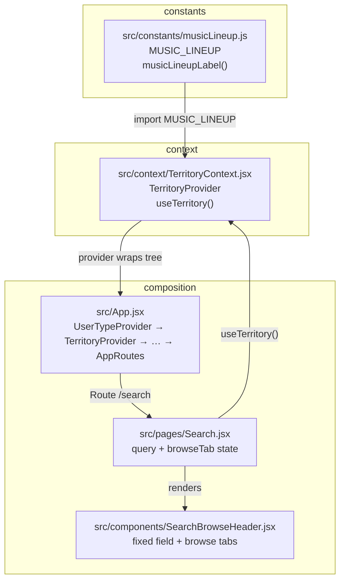

# Music lineup (territory proxy) — tutorial

Step-by-step guide to how **music lineup mode** works in the prototype: a stand-in for *“does this user get ~150 channels or ~1000+?”* without geo-IP or backend. Product background: **`docs/Stories/Search-story.md`** and **`docs/Tutorials/Search-Browse-implementation-plan.md`** (Phase 0).

**Important:** The **double-tap Music** control on the Search tab is a **prototype-only easter egg** for demos. It is **not** intended for a shipping app (real product would derive lineup from territory or account).

---

## What you get

| Mode | Value | Rough meaning | Future Browse shape |
|------|--------|---------------|---------------------|
| **Limited** | `limited` | ~150-channel markets | Top level = **genre** tiles (`MUSIC_GENRES`) |
| **Broad** | `broad` | ~1000+ (e.g. US/CA) | Top level = five **vibes** (Genre, Activity, Mood, Era, Theme); subcategories = **tags** |

State lives in React **context** so any page or component can call **`useTerritory()`** when you wire music Search & Browse (Phase 2).

---

## Code files and relationships

Imports and who renders whom:

**Reading the diagram**

- **`musicLineup.js`** is pure data and labels: no React. It keeps string values stable so you do not typo `'limitted'`.
- **`TerritoryContext.jsx`** holds **`musicLineupMode`** state and exposes **`toggleMusicLineupMode`** / **`setMusicLineupMode`**.
- **`App.jsx`** mounts **`TerritoryProvider`** **inside** **`UserTypeProvider`** so everything under **`Routes`** can use **`useTerritory()`** (if you ever need both user type and lineup in the same component, user type is still the outer provider).
- **`SearchBrowseHeader.jsx`** holds the **fixed** search field and **Music / Podcasts / Radio** tabs (tabs hide in search mode when the trimmed query is non-empty). **`useSearchBrowseHeaderOffset`** publishes **`--search-header-offset`** like **`HomeHeader`** does for Home.
- **`Search.jsx`** is the page: **`useTerritory()`** for the lineup badge + easter egg handler passed into **`SearchBrowseHeader`**.

---

## Step-by-step: try it in the running app

1. Start the dev server (`npm run dev`) and open the prototype.
2. Tap **Search** in the bottom navigation.
3. Confirm **Music** is the selected browse tab in the **header** (pill under the search field).
4. Tap **Music** again while it is already selected.
5. Watch the **“Music lineup: …”** badge switch between **Limited (~150 channels)** and **Broad (~1000+ channels)**.
6. Optional: switch to **Podcasts** or **Radio**, then tap **Music** once — that sets Music active **without** toggling lineup; tap **Music** a second time to toggle lineup.

This matches the handler in **`Search.jsx`**: if **`browseTab === 'music'`**, **`onClick`** calls **`toggleMusicLineupMode()`**; otherwise it only **`setBrowseTab('music')`**.

---

## Step-by-step: use lineup mode in a new component

1. Ensure the component renders **under** **`App`** (it does if it is a normal route or child of **`AppRoutes`**).
2. Import the hook:  
   `import { useTerritory } from "../context/TerritoryContext.jsx";`  
   (Adjust the path from your file location.)
3. Inside the component, call:  
   `const { musicLineupMode, setMusicLineupMode, toggleMusicLineupMode } = useTerritory();`
4. Branch UI or data on **`musicLineupMode`**:
   - Compare to **`MUSIC_LINEUP.limited`** and **`MUSIC_LINEUP.broad`** from **`src/constants/musicLineup.js`** (preferred) or to the strings **`"limited"`** / **`"broad"`**.
5. For labels in the UI, use **`musicLineupLabel(musicLineupMode)`** from **`musicLineup.js`** so copy stays consistent.

**React concept — Context:** **`useTerritory()`** reads the nearest **`TerritoryProvider`** above you in the tree. If you call it outside that provider, it **throws** (same pattern as **`useUserType()`**).

---

## Step-by-step: change the default lineup

1. Open **`src/context/TerritoryContext.jsx`**.
2. Find **`useState(MUSIC_LINEUP.limited)`** in **`TerritoryProvider`**.
3. Change the initial argument to **`MUSIC_LINEUP.broad`** if demos should start in the 1000+ shape.

---

## Step-by-step: reset lineup when the user leaves Search (optional)

Not required today. If a future **Search-story** reset rule should also force **limited** lineup:

- In **`Search.jsx`**, on mount ( **`useEffect`** with **`[]`** ) or when the route becomes active (**`useLocation()`**), call **`setMusicLineupMode(MUSIC_LINEUP.limited)`** — or leave lineup sticky across visits for simpler demos.

Document whichever behavior you choose in **`docs/Stories/Search-story.md`** Integration notes if it becomes product truth.

---

## Related docs

| Doc | Role |
|-----|------|
| [`Search-Browse-implementation-plan.md`](Search-Browse-implementation-plan.md) | Phase 0 delivered; Phase 2 will branch music Browse on **`musicLineupMode`** |
| [`../Stories/Search-story.md`](../Stories/Search-story.md) | Product intent for 150+ vs 1000+ Browse |
| [`../figma-nodes.md`](../figma-nodes.md) | Figma frames **270:45400** (150+) vs **19553:131521** (1000+) |

---

*Last updated: 2026-05-06 — aligns with `TerritoryProvider`, `Search.jsx` Music-tab easter egg, and `musicLineup.js`.*
