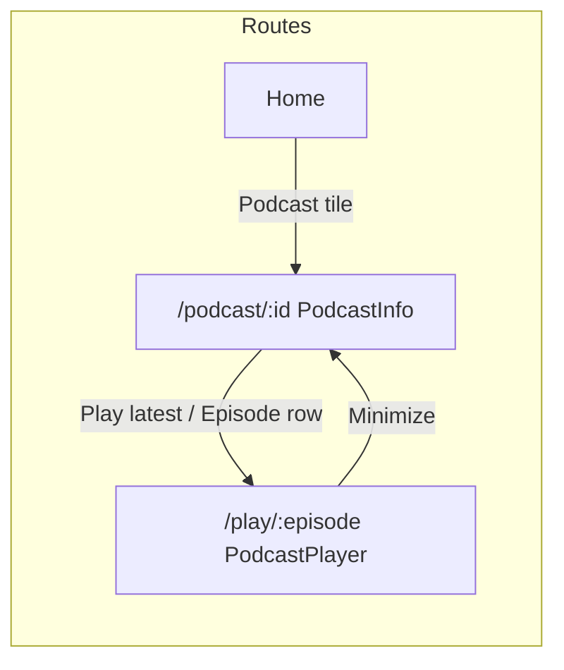

# Podcasts & episodes implementation — tutorial (deep dive)

**Audience:** beginner front-end developer learning React — this repo ships a **prototype** with **fake data**, no backend.

**What this doc covers:** nearly every podcast-related TypeScript-less JavaScript/React file — how it relates to routing, Context, components, and “Listen again.” Lines refer to **`sm-mpr-mobile-prototype`** as of authoring; small shifts are normal.

**Companion:** high-level phased plan — [`Podcasts-implementation-plan.md`](../Plans/Podcasts-implementation-plan.md).

---

## Mental model — read this first

1. **URLs drive screens** (`react-router-dom`). Two podcast surface areas:
   - **Show** — `/podcast/:podcastId` → **`PodcastInfo.jsx`**
   - **Episode playback** — `/podcast/:podcastId/play/:episodeId` → **`PodcastPlayer.jsx`**

2. **Contexts** carry **cross-screen state** without prop-drilling every parent chain:
   - **`PodcastUserStateContext`** — your “library stubs”: subscribed shows, bookmarks, downloads, episode progress fractions.
   - **`PlaybackContext`** — **Now playing strip** headline for **`MiniPlayer`**: titles, thumbnails, **`fullPlayerPath`** (where to navigate when tapping the strip).
   - **`ListenHistoryContext`** — **`Listen again`** buckets (music + podcast show ids).

3. **Episode id is “compound”.** Stored as **`${podcastId}__…`** strings so **`findPodcastAndEpisode(episodeId)`** can locate show + episode from the id alone (**`MiniPlayer`** uses this).

4. **MiniPlayer + full-screen play:** On the **`/play/...`** route, the shell **hides** bottom tabs + **`MiniPlayer`** so the fullscreen player fills the viewport. After **minimize**, you return to **`PodcastInfo`** with **`PlaybackContext`** still populated — **`MiniPlayer`** reappears.



---

## File roster (quick)

| Layer | Files |
| ----- | ------ |
| **Data** | `src/data/podcasts.js` |
| **Constants / utils** | `src/constants/podcastPlayback.js`, `src/constants/fullPlayerNavigation.js`, `src/constants/listenHistory.js`, `src/utils/podcastDuration.js` |
| **Context** | `src/context/PodcastUserStateContext.jsx`, portions of **`PlaybackContext.jsx`**, **`ListenHistoryContext.jsx`**, **`App.jsx`** provider nesting |
| **UI** | `PodcastCard.jsx`, `EpisodeCard.jsx` (+ CSS), **`PodcastInfo.jsx`** (+ CSS), **`PodcastPlayer.jsx`** (+ CSS; extends **`MusicPlayer.css`**) |
| **Chrome** | `MiniPlayer.jsx`, **`ListenAgainCard.jsx`** |
| **Pages wiring** | `Home.jsx`, `SwimlaneMore.jsx`, **`ListenAgainMore.jsx`** |

---

## `src/data/podcasts.js` (large catalog + helpers)

**Purpose:** Synthetic **shows** (**`Podcast`**) each with **`episodes`** (**`PodcastEpisode[]`**).

### Lines **1–35** — role + **`JSDoc`typedefs**

- **File comment** describes what mocks match in Figma and product.
- **`MAX_EPISODES_PER_PODCAST`** caps episode count **per show** so lists stay sane in the prototype.

**Episode fields** (`PodcastEpisode`): `id`, `title`, `thumbnail`, `isNew`, `releaseDate`, `duration` strings for display (`"42 mins"`, `"1 hr 15 mins"`).

**Show fields** (`Podcast`): `id`, category ids + human label `categoryLabel`, `title`, `thumbnail`, show `description`, `episodes` array.

### Lines **35–582** — category metadata + procedural catalog (**not typed line-by-line**)

Rough structure:

1. **`PODCAST_CATEGORIES`** — taxonomy for browse/Home grouping.
2. **`SHOW_TITLES_BY_CATEGORY`**, thumbnails, placeholders — deterministic names/art URLs for procedural generation.
3. Internal helpers (e.g. **`buildPodcast`**) create one **`Podcast`** + **episode list** including **compound **`episode.id`**** pattern **`"${podcastId}__episode-${sn}"`** so lookups work.

Treat this chunk as **“data generator”**. When debugging, **`console.log`** a single **`getPodcastById`** result rather than tracing every synthetic line.

### Lines **594–641** — **exports UI code actually imports**

```text
594: export const PODCASTS = buildCatalog();
```

- Entire searchable catalog (~19 categories × 20 shows × up to **10 episodes**).

```text
596–601: Map byId → getPodcastById(id)
```

- **`Map`** for **O(1)** lookup instead of **`Array.find`** on every navigate.

```text
603–615: getPodcastEpisodeById(podcastId, episodeId)
```

- Returns **`{ podcast, episode }`** or **`null`** if episode does not belong to that show (**invalid URL** hygiene).

```text
617–632: findPodcastAndEpisode(episodeCompoundId)
```

- Scans until **`episodeId.startsWith(podcast.id + '__')`** then finds **`episode`** with matching **`e.id`**.
- Needed when only **`PlaybackContext.podcastEpisodeId`** is known.

```text
635–641: Category helpers — filter shows and resolve category meta
```

---

## `src/constants/podcastPlayback.js` (playback speed stubs)

```text
1–4 JSDoc: UI-only cycling speed (no `<audio>` in prototype).
```

```text
5–7: export const PODCAST_SPEED_STEPS = [0.6, …, 2];
```

Used by **`PodcastPlayer`** **`speedIdx`** state — each tap increments index modulo length.

---

## `src/utils/podcastDuration.js` (episode length → scrubber math)

Prototype episodes store **`duration`** as **printed labels**, not milliseconds.

### **`formatPlaybackClock(totalSec)`**

- **`1–4`** — invalid / non-positive ⇒ **`"0:00"`**.
- **`6–13`** — cap very large values; split **hours / minutes / seconds**; **`padStart`** pads minutes/secs inside hours branch.

### **`approxDurationSecondsFromLabel(label)`**

- **`21–23`** fallback **2700s** (~45 min)** if malformed.
- **`25–41`** **`RegExp`** covers **`1 hr 15 mins`**, plain **`hr`**, **`mins`**, merges into total seconds **`Math.max(60, …)`** so division never blows up.

**Used by:** **`PodcastPlayer`** (progress ticker, seek clamps), **`MiniPlayer`** (**±15 s / +30 s** fractional bump).

---

## `src/constants/fullPlayerNavigation.js` (history-stack safety)

Avoid **two identical `/podcast/:id`** history entries (**Back** looping). Passing **`fullPlayerOverDetail: true`** in **`navigate(..., { state })`** signals: full player was stacked **above** **`PodcastInfo`**.

### Lines explained

```text
1–7 Comments: WHY this exists — replace-vs-pop duplication bug.
```

```text
9: PLAY_OVER_DETAIL = "fullPlayerOverDetail" — key stored on location.state
```

```text
15–16: playOverDetailNavigateState(extras) returns { …extras, [PLAY_OVER_DETAIL]: true }
```

**Used when:** **`PodcastInfo`** navigates into play → **`MiniPlayer`** expands → **`PodcastPlayer`** dismiss uses **`navigate(-1)`** if this flag truthy (**`PodcastPlayer`**, mirrored in music **`MusicPlayer`**).

---

## `src/constants/listenHistory.js` (Listen again caps)

```text
1–2 LISTEN_AGAIN_RAIL_SLOT_CAP = 12 — Home rail ghosts fill to twelve slots visually.
```

```text
4–5 LISTEN_HISTORY_MAX_STORED = 50 — **ListenHistoryProvider** slice cap.
```

---

## `src/context/PodcastUserStateContext.jsx` (prototype “podcast library”)

### Imports **8**

**`findPodcastAndEpisode`** resolves bookmark/download id lists → rich rows.

### **`deriveContinueListening` 17–48**

- Builds **in-progress** items: **`0 < frac < 1`** in **`episodeProgressById`**.
- Skips **`frac <= 0`**, **`>= 1`**, **`NaN`**.
- **Sort** merges podcast + episode id lexicographically for stable demo lists.

### **State slices 52–67**

|`state`|purpose|
|-----------|---------|
|`subscribedPodcastIds`|subscribed show ids|
|`bookmarkedEpisodeIds`|episode compound ids|
|`downloadedEpisodeIds`|stub offline|
|`episodeProgressById`|**`Record<episodeId, 0..1>`** — removed at **0** or **1**|

### **Toggles 69–94**

```text
useCallback + functional setState + includes ? filter : spread-append
```

Classic **immutable** array updates (no **`.push`** on copied state).

### **`setEpisodeProgress` 96–110**

- Clamps fraction **0..1**.
- **`delete`** when **<=0** or **>=1** so “finished / cleared” leaves no key.

### **`getEpisodeProgress` 114–120**

- Optional **`whenMissing`** default **0**.

### **Predicates** **`isSubscribed` / `isBookmarked` / `isDownloaded`** **123–135**

### **Derived lists** **`useMemo` 138–174**

- **`subscribedPodcasts`** — map ids → Podcast objects.
- **`bookmarkedEpisodes` / `downloadedEpisodes`** — map ids through **`findPodcastAndEpisode`**.
- **`newEpisodeRows`** — prototype “new from subs” = first catalog episode per subscribed show.
- **`continueListening`** — calls **`deriveContinueListening`**.

### **Provider value 176–215**

All state + functions collected so **`useMemo`** consumers only re-render when dependencies change.

### **`usePodcastUserState` 224–231**

```text
if (!ctx) throw — hook outside provider is a programming mistake.
```

---

## `src/context/PlaybackContext.jsx` (podcast-relevant lines)

### **`initialSession` 18–31**

**`podcastId`**, **`podcastEpisodeId`**, nullable when music plays.

### **`hideMiniOnFullPlayer` 38–40**

Second regex matches **`/podcast/.../play/...`** → **`miniPlayerVisible`** false on that path.

### **`upsertPodcastSession` 61–84**

Set **`variant: 'podcasts'`**, clear **`channelId`**, build **`fullPlayerPath`** from ids.

### **`upsertMusicSession` 87–107**

Clears **`podcastId` / `podcastEpisodeId`** so mixed sessions don’t leak.

### **`startPodcastDemo` 112–124**

**`Info.jsx`** demo — **no** **`fullPlayerPath`** so the mini intentionally does not open full-screen play from the strip.

### **Exports** **`usePlayback`** same provider pattern.

---

## `src/context/ListenHistoryContext.jsx` (podcasts)

### **`bumpItem` 17–21**

Dedupe **`kind`** + **`id`**, prepend newest, **`slice`** cap **`LISTEN_HISTORY_MAX_STORED`**.

### **`recordPodcastShowListen` 34–39**

Adds **`{ kind: 'podcast', id: podcastShowId }`**.

**Consumed by:** **`ListenAgainCard`**, **`Home`**, **`ListenAgainMore`** (via **`renderListenAgainTile`**).

---

## `src/components/PodcastCard.jsx`

```text
1: import shared tile shell.
```

```text
8–17: Stateless wrapper props → ContentTileCard
```

Passes **`subtitle={podcast.categoryLabel}`** vs music’s channel-specific subtitle pattern.

---

## `src/components/EpisodeCard.jsx` + **`EpisodeCard.css`**

### **JSX file**

|**Lines**|**Meaning**|
|-----------|------------|
|1–6|Docblock — tapping row enters play route; glyph buttons intercept.|
|8–92|Tiny **SVG icons** inlined (bookmark / download / remove).|
|108–117|Exported component signature — **everything** arrives from **`PodcastInfo`**.|
|118–133|Clamp **`progressFraction`** → **`p`**, derive **`inProgress` / complete** booleans.|
|135|Meta sentence combines date + **`episode.duration`** string.|
|137–149|Delegated click/key handler **ignores clicks from **`data-episode-card-action`**** children — otherwise bookmark press would bubble as “navigate”.|
|158–246|Accessibility: **`article`**, **`role="button"`**, **`tabIndex`**, progress bar **`scaleX`**, stub resume button optional.|

### **CSS file** (**selected blocks**)

- **`.episode-card` (3–21)** — card layout, resets border, inherits color, **`cursor: pointer`**.
- **`.episode-card__thumb-wrap` / `.episode-card__thumb`** — fixed **62 px** art.
- **`.episode-card__progress-fill`** (**later lines**) animates **`transform: scaleX(p)`**.

---

## `src/pages/PodcastInfo.jsx` + **`PodcastInfo.css`**

### **Imports 1–10**

Reuse **`MusicChannelInfo.css`** for hero column layout; **`playOverDetailNavigateState`** tags stack.

### **`useParams`** **podcastId 14**, **`useNavigate`** **15**, **`useState`** **`descExpanded` 16**.

### **`usePodcastUserState` 18–29** pulls needed actions/selectors only.

### **`getPodcastById`** **31–36** **`Navigate`** if unknown id.

### **Navigation helpers 38–54**

|**Lines**|**Purpose**|
|------|---------|
|38|`goBack` — browser history (**`-1`**).|
|39–46|**`playFirstEpisode`** — navigates **`/podcast/../play/{firstEpisode.id}`** with **`fullPlayerOverDetail`**.|
|51–53|Prototype **stub toggle** midway progress for QA.|
|56–65|Library preview text chip list.|

### **JSX 67–182**

|`Block`|Notes|
|-----------|-------|
|`ScreenHeader` back|Leaves show screen.|
|`music-info__hero`|Show thumbnail + **`ButtonSmall`** trio **Play / Subscribe / Share**.|
|Description + **More**|`**`descExpanded`** toggles CSS clamp on the paragraph.|
|**`episode map` 159–175**|each **`EpisodeCard`** receives **`onNavigate`** with **same **`playOverDetailNavigateState()`**.|

### **`PodcastInfo.css`**

|`Selector`|Role|
|-----------|-------|
|**`.podcast-info__library-preview`**|Muted helper text sizing.|
|**`.podcast-info__episodes-scroll`**|Horizontal overflow hidden for the column trick; scrollbar none.|
|**`.podcast-info__episodes-stack`**|Vertical stack with bottom padding for footer clearance token.|

---

## `src/pages/PodcastPlayer.jsx` (+ shared **`MusicPlayer.css`**)

Imports add **preroll**, **grace**, **`PLAY_OVER_DETAIL`**, **speed**, **duration utils**, **`useListenHistory`**.

Local **icon subcomponents** mirror **`MusicPlayer`** mask pattern.

### **Hooks block 113–163**

|**Chunk**|**Role**|
|---------|--------|
|**`useParams` / `useLocation` / `useNavigate`**|Read ids + navigation state.|
|**`usePlayback`**|Write session while player visible.|
|**`useGuestPrerollGrace`**|Guest **grace** window after preroll.|
|**`useListenHistory`**|**`recordPodcastShowListen`**.|
|**`useUserType`**|Guest vs provided vs subscribed — ads + preroll gates.|
|**`needsPreroll` / `expandFromMini` / `skipPrerollGate`**|Skip preroll when expanding from mini or grace active.|
|**`useState`**|`prerollComplete`, `playing`, `speedIdx`.|
|**`usePodcastUserState`**|Bookmark + progress map reads/writes.|
|**Refs 138–142**|Interval callback reads **latest** setter/getter without stale closures.|
|**`listenHistoryRecordedForEpisodeRef`**|One history write per episode session.|

### **Resolve data 144–163**

Even before early returns, compute **`podcast` / `bundle` / `episode`** nullably — **Rules of Hooks** demand stable hook order.

### **`useLayoutEffect` 165–176**

If session already matches this route, sync **`playing`** from **`session.isPaused`**.

### **`useEffect` session writer 178–199**

After preroll gate, **`upsertPodcastSession`** whenever **`playing`** flips or metadata changes.

### **Timer `useEffect` 201–230**

While **`playing`**, every **1 s**, add **`speed / durationSec`** to fractional progress via refs; clamp end.

### **Listen history 232–251**

Reset ref on **`episode?.id`** change; after gate + engagement (**`playing` || position > **0.05**), record **show id** once.

### **Guards 254–261** **`Navigate`** fallbacks.

### **Handlers 264–302** dismiss (stack pop vs **`replace`**), seeks, scrubber, speed cycle.

### **Render 304–477**

Conditionally mount **`PlayerPrerollAd`**, reuse **`music-player__*`** chrome classes, bookmark pill, **`VisualAdStrip`** when ads on.

---

## `src/pages/PodcastPlayer.css`

Extends **`MusicPlayer.css`**:

- **Time row**, **bookmark-on** color token, **seek mask** URLs (**`/replay15.svg`**, **`/fwd30.svg`**).
- **`.podcast-player__progress` / `__range`** — CSS **grid** stacks invisible **`<input type="range">`** over the **4 px** track so thumb receives touches.
- **Speed pill** **`.podcast-player__speed`**.

---

## `src/components/MiniPlayer.jsx` (podcast branch)

### **Imports 1–7**

**`playOverDetailNavigateState`**, **`findPodcastAndEpisode`**, **`approxDurationSecondsFromLabel`**.

### **Lines 33–40**

If **`!miniPlayerVisible`** return **`null`** — entire strip hidden.

### **`bumpPodcastProgressSeconds` 45–55**

Resolves duration from **mock label**, converts current fraction → seconds, adds delta, writes back **0..1**.

### **`openFullPlayer` 57–66**

**`navigate(fullPlayerPath, { state: playOverDetailNavigateState({ expandFromMiniPlayer: true }) })`** — **skip preroll** path in player.

### **JSX 118–180** **`variant === 'podcasts'`**

Three controls: **−15**, **play/pause** (**`togglePlayPause`** touches **`PlaybackContext`**), **+30** — **`e.stopPropagation()`** avoids firing **`openFullPlayer`** on the artwork row mistakenly.

---

## `src/components/ListenAgainCard.jsx`

```text
12–36 renderListenAgainTile — switch kind
```

- **`music`**: resolves channel **`item.id`**; **`navigate('/music/'+ch.id)`** (channel info).
- **`podcast`**: **`getPodcastById`**; failure returns **`null`** (stale ids).
- Default **`null`** guard for unknown future kinds.

Wrapper component **`47–49`** delegates to **`renderListenAgainTile`** so **`ListenAgainMore`** can **`map`** manually.

---

## `src/App.jsx` (routing + overlays)

| Lines | Podcast specifics |
| ----- | ---------------- |
| **30–33** | **`PodcastPlayerRoute`** keyed by ids + **`userType`** — remount resets local player state when flipping guest/demo modes. |
| **36–40** | **`hideBottomNavForPath`** second regex ⇒ no **`BottomNav`** / **`MiniPlayer`** on the podcast **`/play/...`** route. |
| **58–59** | Route order **play-before-show** avoids **`.../play`** being matched as **`/podcast/:podcastId`** only. |
| **80–83** | **`PodcastUserStateProvider`** wraps **`PlaybackProvider`** so **`MiniPlayer`** can use **`usePlayback`** + **`usePodcastUserState`**. |

---

## `Home.jsx` / `SwimlaneMore.jsx` (thin wiring)

| File | What to notice |
| ---- | ----- |
| **`Home.jsx`** | Podcast swimlane: **`PodcastCard`** **`onSelect={() => navigate(`/podcast/${podcast.id}`)}`**. **`Listen again`** **`map`** yields mixed **`listenAgainItems`**. |
| **`SwimlaneMore.jsx`** | **`CATEGORIES.podcasts`** maps shows to **`PodcastCard`** with the same **`navigate(`/podcast/${podcast.id}`)** pattern as Home. |

---

## **`ListenAgainMore.jsx`**

Delegates grid cells to **`renderListenAgainTile`**. Clearing history wipes **music + podcasts** uniformly.

---

## Study order (recommended)

1. **`podcasts.js` exports + one sample object** logged in DevTools — understand **compound episode ids**.
2. **`PodcastInfo.jsx`** → **`EpisodeCard.jsx`** navigate path.
3. **`PlaybackContext.upsertPodcastSession`** + **`PodcastPlayer`** **`useEffect`** writer.
4. **`fullPlayerNavigation.js`** + dismiss handler — draw three-step history stacks on paper.
5. **`PodcastUserStateContext`** — bookmark + progress mutations.
6. **`MiniPlayer`** podcast branch linking **delta seconds** ↔ **fraction**.
7. **`ListenHistoryContext`** + **`ListenAgainCard`**.

---

## Glossary — terms that repeat

|**Term**|Meaning here|
|-----------|----------------|
|**Compound episode id**|**`"${podcastId}__episode-…"`** string.|
|**`upsert`**|Insert or overwrite “now playing” session shape.|
|**`PLAY_OVER_DETAIL`**|Signals browser history stacked **detail → fullscreen play**.|
|**`position01`**|Episode progress fraction **0..1** excluding exact ends stored as “no progress.”|
